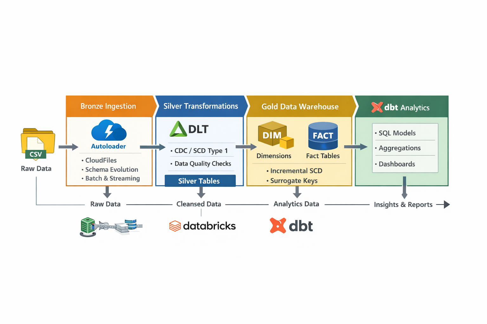
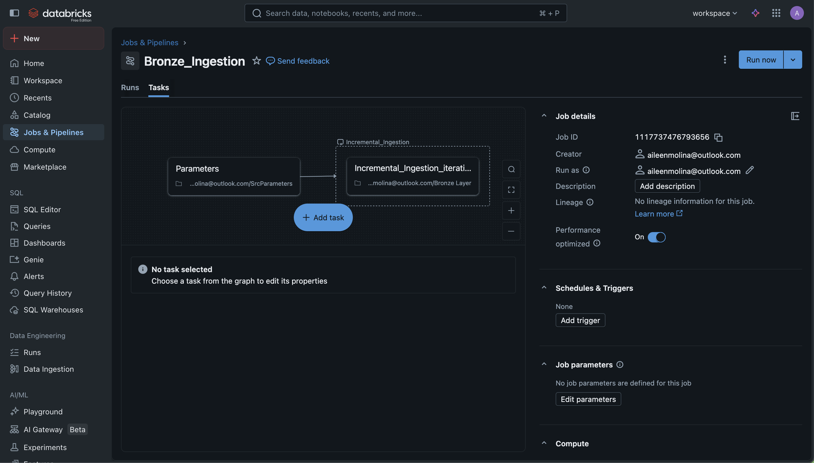
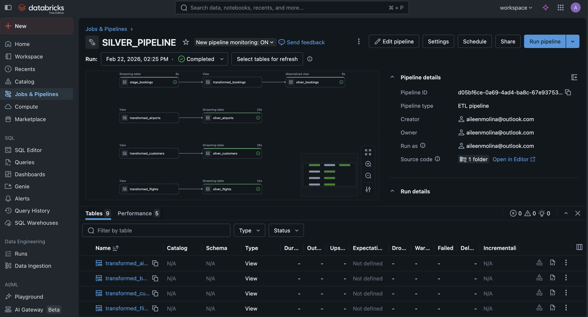

# Airline Data Pipeline Portfolio

[](https://databricks.com/) 
[](https://www.getdbt.com/) 
[](https://spark.apache.org/)

---

## **Project Overview**

This project demonstrates an **end-to-end data engineering pipeline** for airline data using **Databricks and dbt**. It simulates real-world airline operations, including:

- Customer bookings  
- Flights and airports data  
- Gold-layer dimensions and fact tables  
- Analytics-ready dbt models  

The goal is to showcase **pipeline design, transformations, incremental loads, and data modeling** in a portfolio-ready project.

---

## **Pipeline Diagram**



### **Pipeline Screenshots**

**1️⃣ Bronze Ingestion Pipeline (Autoloader)**  


**2️⃣ Silver Pipeline (DLT + CDC)**  


---

## **Tech Stack**

- **Databricks**: Delta Lake, notebooks, DLT pipelines  
- **PySpark**: Transformations, CDC handling, incremental processing  
- **dbt**: Analytics layer, incremental models, testing, documentation  
- **Delta Lake**: SCD handling, ACID-compliant tables  
- **GitHub**: Version control and portfolio organization  

---

## **Project Highlights / Skills Demonstrated**

- End-to-end pipeline design: Raw → Bronze → Silver → Gold → Analytics  
- Data modeling: Dimensions (`DimPassengers`, `DimFlights`, `DimAirports`) and Fact tables (`FactBookings`)  
- Incremental loads and CDC for streaming-like pipelines  
- Data quality and testing using dbt (`unique`, `not_null`)  
- Python & SQL scripting for transformations  
- Clear documentation and reproducible portfolio-ready repo structure  

---

## **Design Considerations & Decisions**

- **SCD for Dimensions:**  
  Typically, dimension tables like `DimPassengers` or `DimFlights` use **Slowly Changing Dimension Type 2 (SCD2)** to preserve historical changes.  
  For this project, **incremental loads without full SCD2** were implemented to simplify the pipeline and focus on showcasing **end-to-end flow and dbt integration**.  

- **Fact Table Aggregations:**  
  `FactBookings` aggregates metrics per customer, flight, and airport.  
  In production, additional metrics like cancellations or multi-leg flights could be included.

- **Data Quality Testing:**  
  dbt tests enforce **unique surrogate keys** and **not null constraints**.  
  Additional production-level validations could include **range checks** and **reference data comparisons**.

- **Pipeline Choices:**  
  - Bronze → Silver → Gold structure follows **Delta Lake best practices**.  
  - Autoloader + DLT + CDC handles streaming ingestion; for portfolio purposes, **batch simulations** were used.  


---

## **Folder Structure**

```text
airline-data-pipeline-portfolio/
├─ README.md
├─ images/
│  ├─ airline_data_pipeline_diagram.png
│  ├─ bronze_ingestion_job.png
│  └─ silver_pipeline.png
├─ notebooks/
│  ├─ 📓 01_bronze_ingestion_autoloader/
│  ├─ 📓 02_silver_pipeline/
│  └─ 📓 03_gold_notebooks_dynamic/
└─ dbt/
   ├─ dbt_project.yml
   └─ models/
      └─ gold/
         ├─ 📝 01_customer_bookings_summary.sql
         ├─ 📝 02_flight_operations_performance.sql
         ├─ 📝 03_airport_performance.sql
         └─ 📝 schema.yml
