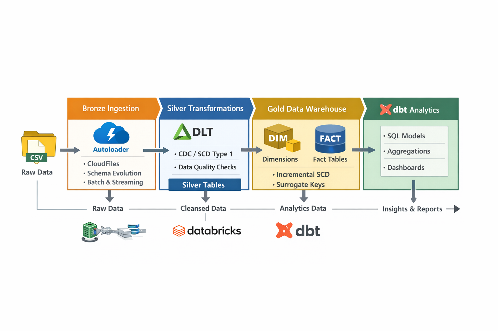
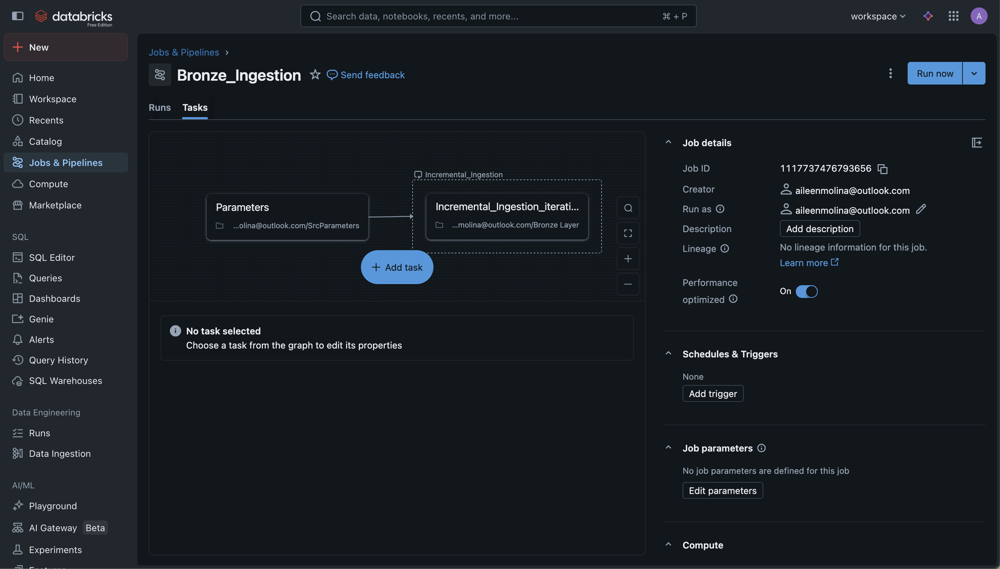
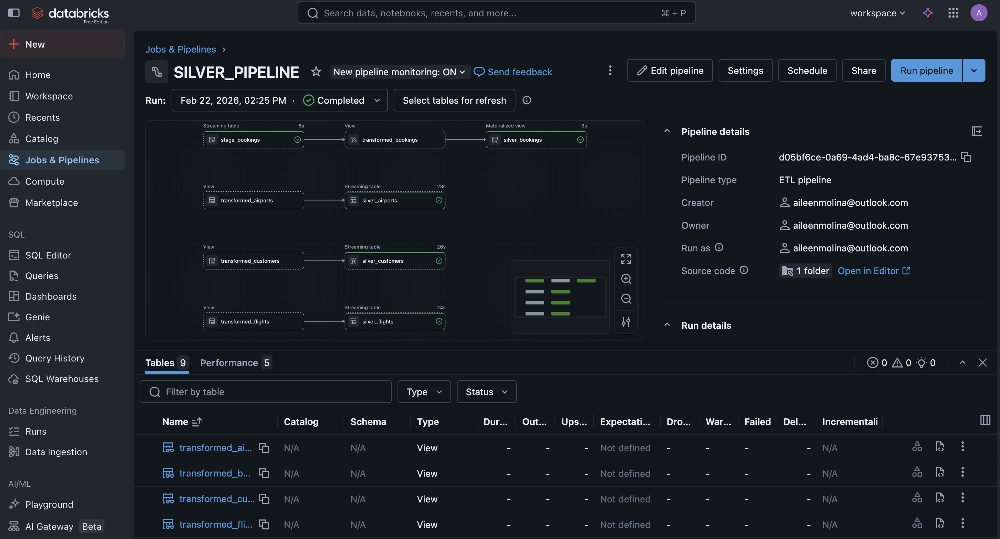

# Airline Operational Data Analytics Pipeline 

[](https://databricks.com/) 
[](https://www.getdbt.com/) 
[](https://spark.apache.org/)

---

## **Project Overview**

> End-to-end data engineering pipeline built in Databricks using Medallion Architecture, declarative DLT pipelines, and dbt for analytics-ready modeling.

---

## **Pipeline Architecture**



### **Pipeline Screenshots**

**1️⃣ Bronze Ingestion Pipeline (Autoloader)**  


**2️⃣ Silver Pipeline (DLT + CDC)**  


---
## 📌 What This Does
 
Simulates real-world airline operations data across flight schedules, customer bookings, and airport activity. Built to reflect production patterns rather than tutorial structure — incremental ingestion, CDC handling, parameterized dynamic notebooks, and a tested dbt layer on top.

Dataset covers 500+ records across flights, bookings, and airport dimensions. Auto Loader ingestion was validated by introducing new files mid-pipeline to confirm incremental behavior and rule out reprocessing.
 
---

## 🛠️ Tech Stack
 
| Layer | Tools |
|---|---|
| Ingestion | Databricks Auto Loader |
| Transformation | PySpark, Databricks DLT |
| Storage | Delta Lake |
| Analytics | dbt Core |
| Orchestration | Databricks Notebooks (dynamic) |
| Version Control | GitHub |

---
## 🏗️ Design Decisions
 
### Dynamic Notebooks Over Hardcoded Values
Pipeline logic is fully parameterized so nothing is environment-specific or brittle. Values are passed at runtime rather than embedded in notebook cells, making the pipeline portable and easier to maintain.
 
### Declarative DLT Pipelines
Used Databricks DLT for the Silver layer to define pipeline logic declaratively rather than imperatively. This keeps transformation logic readable and lets Databricks handle dependency resolution and error recovery automatically.
 
### Incremental Loads Without Full SCD2
Dimension tables like `DimPassengers` and `DimFlights` would use SCD Type 2 in production to preserve historical changes. Simplified here to incremental loads to keep focus on end-to-end architecture and dbt integration rather than historical tracking overhead.
 
### dbt Testing
Surrogate key uniqueness and null constraints enforced across all Gold models. Tested CDC behavior and incremental model logic by introducing new records mid-pipeline to validate that only net-new data was processed downstream.
 
---
## ▶️ How to Run This
 
### Prerequisites
- Databricks workspace (any tier)
- dbt Core installed locally
- Git
 
### Steps
 
```bash
# 1. Clone the repo
git clone https://github.com/aileenmolina/airline-data-pipeline-portfolio.git
 
# 2. Import notebooks into your Databricks workspace
 
# 3. Run notebooks in order:
#    01_bronze_ingestion_autoloader
#    02_silver_pipeline
#    03_gold_notebooks_dynamic
 
# 4. From the dbt/ directory:
dbt run
dbt test
```
 
---
# 🔮 Production Considerations
 
This is a portfolio project with intentional simplifications. In a production environment this pipeline would extend to include:
 
- **Orchestration** — Airflow or Databricks Workflows for scheduling and dependency management
- **Secrets management** — environment variables or a secrets manager rather than hardcoded configs
- **Monitoring and alerting** — pipeline failure notifications and data quality anomaly detection
- **Full SCD2** — historical tracking on dimension tables for slowly changing attributes
- **Data volume scaling** — partitioning strategy would need revisiting at production scale
 
---

## **Folder Structure**

```text
airline-data-pipeline-portfolio/
├─ README.md
├─ images/
│  ├─ airline_data_pipeline_diagram.png
│  ├─ bronze_ingestion_job.png
│  └─ silver_pipeline.png
├─ notebooks/
│  ├─ 📓 01_bronze_ingestion_autoloader/
│  ├─ 📓 02_silver_pipeline/
│  └─ 📓 03_gold_notebooks_dynamic/
└─ dbt/
   ├─ dbt_project.yml
   └─ models/
      └─ gold/
         ├─ 📝 01_customer_bookings_summary.sql
         ├─ 📝 02_flight_operations_performance.sql
         ├─ 📝 03_airport_performance.sql
         └─ 📝 schema.yml

---
## 👩‍💻 Author
 
**Aileen Molina** — Data Engineer  
[LinkedIn](https://linkedin.com/in/aileenmolina) · [GitHub](https://github.com/aileenmolina)
